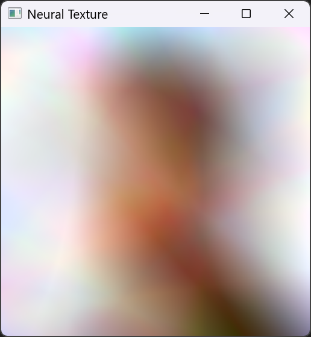

# GPU deep-learning with CUDA for real-time neural texturing.
The current goal is to use a neural network to predict the color of a texture, using only the UVs as input. For now, textures are trained on the CPU using [X13-A/neural-network-from-scratch](https://github.com/X13-A/neural-network-from-scratch), a C++ MLP training framework I previously built.

## Features

### Available now
- Parameters loading
- MLP inference
- Draw to GLFW window

### Road map
- Add support for training
- Optimize inference

## Results

<figure>
  
  <figcaption style="text-align:center; text-">
  
  <em> Example of a poorly trained texture. Inference takes ~18ms on a mobile RTX 4050 (60W), at 512x512 resolution. </em>
  
  </figcaption>
</figure>