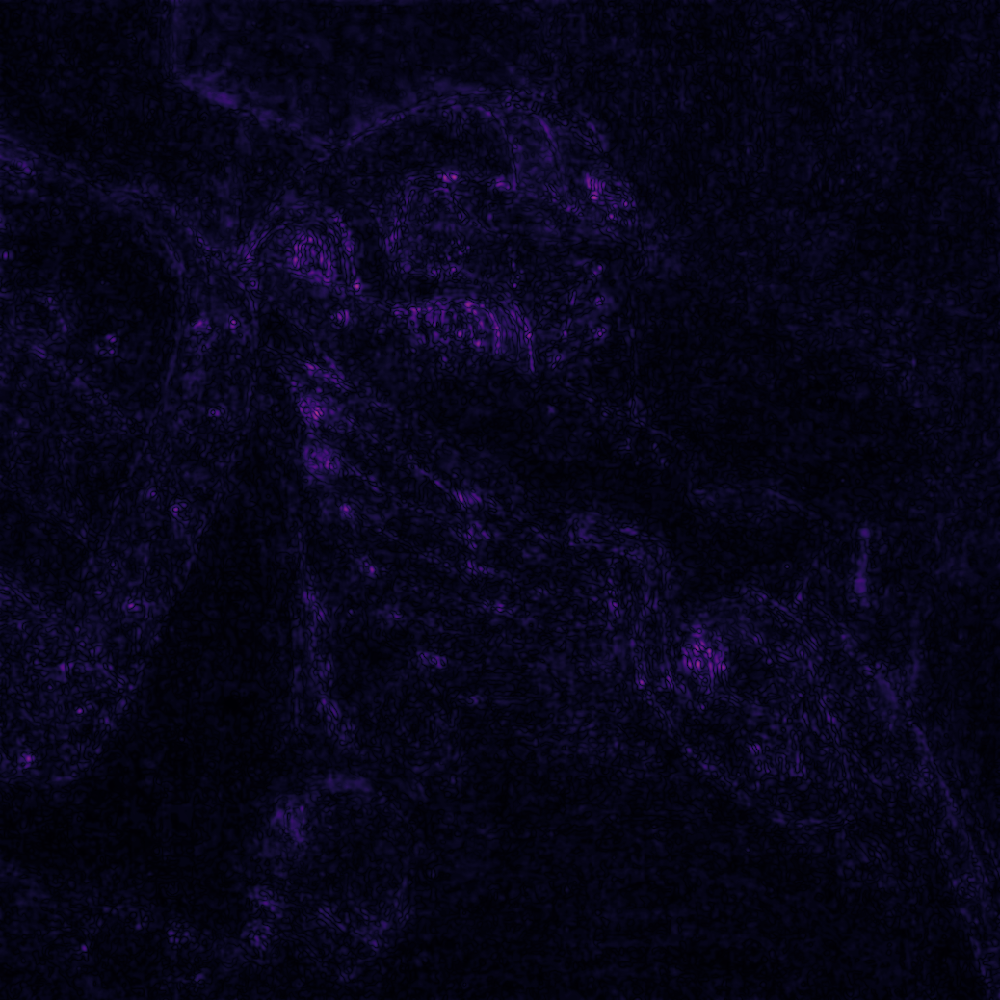

# Real-time Neural Textures
A framework allowing training of a neural network that learns to synthesize any image or texture in real-time. To put things simply, the model learns to map UV coordinates to RGB values.

The project is more or less a CUDA / C++ implementation of the chapter "Real-Time Neural Network Implementation for GPUs" by Jakub Bokšanský in GPU Zen 4.

It is optimized for real-time inference and online training, allowing it to learn a decent representation of any image in only a few milliseconds.

## Results overview

<table>
  <tr>
    <td width="33.3%"></td>
    <td width="33.3%"></td>
    <td width="33.3%"></td>
  </tr>
  <tr>
    <td align="center"><em>Source</em></td>
    <td align="center"><em>Render</em></td>
    <td align="center"><em>FLIP</em></td>
  </tr>
</table>

Read more about the project and the results on my [portfolio page](https://www.lix.polytechnique.fr/~foulon/#/projects/neural-textures)!

## Requirements

- Windows
- CUDA Toolkit 12.0 or newer
- MSVC and the Windows SDK